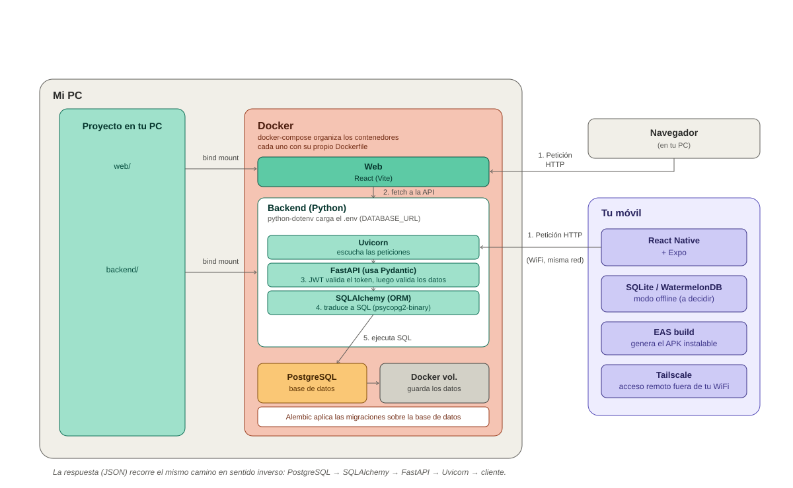

# Training Life 🏋️

App de entrenamiento de gimnasio para uso personal — pensada para sustituir el bloc de notas donde apunto mis entrenamientos, con web y app móvil sincronizadas a través de un backend propio.

## Stack

| Capa | Tecnología |
|---|---|
| Backend | FastAPI (Python) + PostgreSQL, con SQLAlchemy (ORM) y Alembic (migraciones) |
| Web | React |
| Móvil | React Native + Expo |
| Infraestructura | Docker Compose |

Frontend (web y móvil) siempre habla con el backend a través de API REST — nunca acceden directamente a la base de datos.

## Estructura del repositorio

Monorepo: backend, web y móvil viven en un único repo porque están acoplados entre sí (un cambio en un endpoint afecta a los dos frontends) y porque un único `docker-compose.yml` levanta todo el entorno de golpe.

```
training-life/
├── backend/          # API REST (FastAPI + PostgreSQL)
├── web/              # Frontend web (React)
├── mobile/           # App móvil (React Native + Expo)
├── docker-compose.yml
├── .env.example
├── .gitignore
├── arquitectura_completa_training_life.svg
├── CLAUDE.md
└── README.md
```

## Arquitectura



Diagrama de la arquitectura **completa y final** del proyecto (backend, web y móvil, con el recorrido de una petición de principio a fin). Sirve para entender de un vistazo cómo encajan todas las piezas entre sí — no refleja el estado actual del desarrollo, para eso está el checklist de la siguiente sección.

## Estado actual

🚧 Proyecto en fase inicial.

- [x] Estructura de carpetas del monorepo (`backend/`, `web/`, `mobile/`)
- [x] `.gitignore` del monorepo
- [x] Backend: esqueleto FastAPI + Docker Compose + PostgreSQL levantados y comunicándose
- [x] Backend: primer modelo (`Ejercicio`) con su tabla creada en PostgreSQL vía migración de Alembic
- [x] Backend: esquema completo de base de datos diseñado (todas las tablas del MVP, relaciones y estrategia de borrado)
- [ ] Backend: modelos de SQLAlchemy actualizados al esquema final + endpoints CRUD del MVP (ejercicios, entrenamientos, rutinas)
- [ ] Web: React consumiendo la API
- [ ] Móvil: React Native + Expo
- [ ] Sincronización offline-first móvil ↔ PC

El orden de desarrollo es intencional: primero el backend, probado de forma aislada (FastAPI genera una documentación interactiva en `/docs` donde se puede probar cada endpoint sin necesidad de frontend), después la web, y al final el móvil, cuando la API ya esté madura y estable.

## Cómo levantar el proyecto

Requiere [Docker](https://www.docker.com/) instalado.

1. Copia `.env.example` a `.env` en la raíz del repo (las credenciales de ahí son solo para desarrollo local).
2. Levanta los contenedores:

   ```bash
   docker compose up -d --build
   ```

3. Comprueba que la API responde en [http://localhost:8000/health](http://localhost:8000/health), y explora los endpoints disponibles en [http://localhost:8000/docs](http://localhost:8000/docs).

Al arrancar, el propio backend aplica automáticamente las migraciones de base de datos pendientes (con Alembic) antes de levantar la API — no hace falta ningún paso manual para tener las tablas creadas.

La base de datos PostgreSQL queda expuesta en el puerto `5433` del host (no el `5432` por defecto, para no chocar con una instalación nativa de PostgreSQL).

Para detener todo: `docker compose down` (los datos de la base de datos persisten en un volumen; añade `-v` si además quieres borrarlos).

## Roadmap de funcionalidades

**MVP**
- Registro de entrenamientos por día (ejercicio, series, repeticiones, peso, RPE)
- Biblioteca de ejercicios
- Historial de progresión por ejercicio
- CRUD de rutinas/plantillas reutilizables

**Nivel medio**
- Gráficas de progresión y volumen semanal
- Calculadora de 1RM estimado
- Autenticación (JWT)
- Vista de calendario semanal

**Nivel avanzado**
- Sugerencias automáticas de progresión de carga
- Exportar/backup de datos
- Sincronización offline-first móvil ↔ PC
