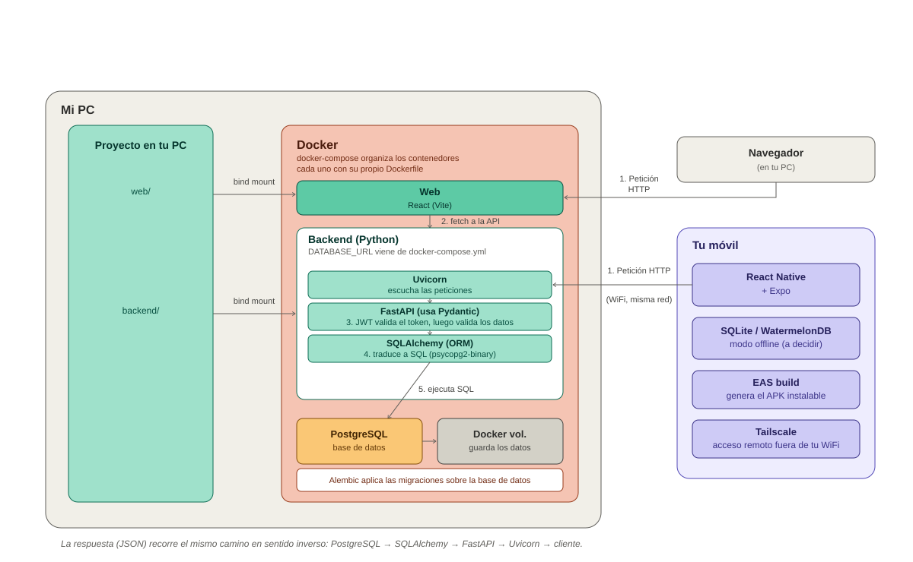
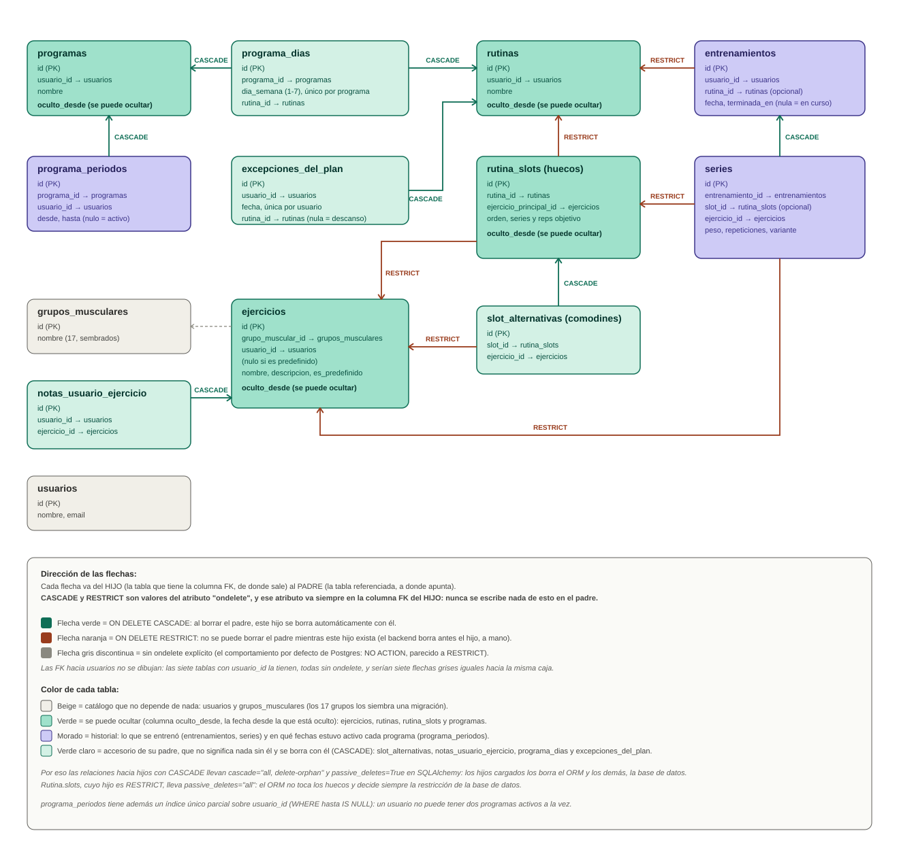

# Training Life 🏋️

App de entrenamiento de gimnasio para uso personal — pensada para sustituir el bloc de notas donde apunto mis entrenamientos, con web y app móvil sincronizadas a través de un backend propio.

## Stack

| Capa | Tecnología |
|---|---|
| Backend | FastAPI (Python) + PostgreSQL, con SQLAlchemy (ORM) y Alembic (migraciones) |
| Web | React + TypeScript, con Vite |
| Móvil | React Native + Expo |
| Infraestructura | Docker Compose |

Frontend (web y móvil) siempre habla con el backend a través de API REST — nunca acceden directamente a la base de datos.

## Estructura del repositorio

Monorepo: backend, web y móvil viven en un único repo porque están acoplados entre sí (un cambio en un endpoint afecta a los dos frontends) y porque un único `docker-compose.yml` levanta todo el entorno de golpe.

```
training-life/
├── backend/                                 # API REST (FastAPI + PostgreSQL)
├── web/                                     # Frontend web (React)
├── mobile/                                  # App móvil (React Native + Expo)
├── docker-compose.yml                       # orquesta los contenedores (backend + PostgreSQL)
├── .env.example                             # plantilla de variables de entorno para docker-compose.yml
├── .gitignore                               # qué no subir a git, por carpeta
├── docs/                                    # diagramas y diseño de la app (ver más abajo)
└── README.md                                # este archivo
```

Cómo se conectan: `docker-compose.yml` es el que junta todo en tiempo de ejecución — lee las credenciales de `.env` (la copia real de `.env.example`, sin subir a git) y levanta `backend/` junto a PostgreSQL con un solo comando. `web/` y `mobile/` no acceden a la base de datos ni al `docker-compose.yml` directamente: hablan con el backend ya levantado, por HTTP.

## Arquitectura



Diagrama de la arquitectura **completa y final** del proyecto (backend, web y móvil, con el recorrido de una petición de principio a fin). Sirve para entender de un vistazo cómo encajan todas las piezas entre sí — no refleja el estado actual del desarrollo, para eso está el checklist de la siguiente sección.

## Modelo de datos



Las 13 tablas de la app, con lo que más condiciona el diseño: qué relaciones arrastran el borrado (`CASCADE`), cuáles lo impiden mientras exista historial (`RESTRICT`), y qué tablas se pueden ocultar, cuáles son historial y cuáles son accesorios que se borran con su padre. Además de la biblioteca de ejercicios, las rutinas y lo entrenado, están los programas semanales, en qué fechas estuvo activo cada uno y los días que se cambian a mano.

## Diseño de la app

Antes de construir las pantallas de verdad, la app entera se diseñó en bocetos de móvil (390 px de ancho, pensada para usarse con una mano en el gimnasio). La web y el móvil tendrán las mismas pantallas y funciones; la versión de escritorio es la misma con más aire.

- **[Bocetos de todas las pantallas](docs/bocetos-movil-training-life.png)**: las 16 pantallas de la app en todos sus estados (editando, confirmaciones, elementos ocultos, primera vez…), cada una con una nota que explica qué hace y desde dónde se llega.
- **[Mapa de navegación](docs/mapa-navegacion-training-life.png)**: cómo se pasa de una pantalla a otra, agrupado por las cuatro secciones de la barra de pestañas (Entrenar, Historial, Programas y Ejercicios).
- **[Guía de producto](docs/guia_de_producto.md)**: el texto que acompaña a los bocetos — qué hace cada pantalla, las reglas que siguen todas (confirmaciones, ocultar frente a borrar, qué toca cada día) y lo que el diseño pide al backend.

Los dos son imágenes grandes: se leen mejor abriéndolas y ampliando. Junto a cada una está su versión interactiva (`.html`), que se abre en el navegador y permite moverse y hacer zoom por el lienzo.

## Estado actual

🚧 Backend completo para el diseño de la app: ejercicios (con 59 predefinidos en 17 grupos musculares), rutinas, programas semanales, qué toca cada día y su planificación, entrenamientos y series, notas e historial de progresión. La web ya sirve para entrenar: registra un entrenamiento serie a serie. El móvil, sin empezar.

El proyecto acaba de pasar por una fase de **diseño**: antes de seguir construyendo pantallas sueltas se ha definido la app entera —qué pantallas hay, cómo se navega entre ellas y qué hace cada una— para implementarla con criterio en vez de a trozos (ver [Diseño de la app](#diseño-de-la-app)). De ahí salieron dos pasos: ampliar el modelo de datos con lo que pedía ese diseño, ya hecho, y rehacer la web siguiéndolo, que es lo siguiente.

- [x] Estructura de carpetas del monorepo (`backend/`, `web/`, `mobile/`) y Docker Compose (FastAPI + PostgreSQL) funcionando
- [x] Esquema completo de base de datos diseñado (todas las tablas del MVP, relaciones y estrategia de borrado)
- [x] Backend: CRUD completo de `Ejercicio` (crear/listar/ver/editar/borrar con borrado lógico y definitivo, ocultar y volver a mostrar) y `GrupoMuscular` (listar)
- [x] Backend: CRUD completo de `Rutina` (con sus huecos y comodines anidados, mismo patrón de borrado)
- [x] Backend: `Entrenamiento` y `Serie` (registro real, con peso/repeticiones/RPE, base del historial de progresión)
- [x] Backend: notas personales por ejercicio (privadas de cada usuario, también sobre los ejercicios predefinidos)
- [x] Backend: historial de progresión, por ejercicio y por hueco de rutina (con filtros de fecha)
- [x] Backend: tests automáticos con pytest sobre PostgreSQL real (borrados en cascada, aislamiento por usuario, CRUD)
- [x] Web: proyecto React + TypeScript (Vite) hablando con la API, con la pantalla de ejercicios
- [x] Web: registrar un entrenamiento (elegir rutina y anotar las series hueco a hueco)
- [x] Diseño de la app completo: pantallas, navegación y comportamiento, en móvil primero
- [x] Backend: ampliar el modelo según el diseño — programas semanales (qué rutina toca cada día), planificación por fecha, sesiones abiertas y una biblioteca de ejercicios predefinidos
- [ ] Web: rediseño según lo anterior — hoy, sesión, calendario, progresión, programas y ejercicios
- [ ] Móvil: React Native + Expo
- [ ] Sincronización offline-first móvil ↔ PC

El orden de desarrollo es intencional: primero el backend, probado de forma aislada (FastAPI genera una documentación interactiva en `/docs` donde se puede probar cada endpoint sin necesidad de frontend), después la web, y al final el móvil, cuando la API ya esté madura y estable.

## Cómo levantar el proyecto

Requiere [Docker](https://www.docker.com/) instalado.

1. Copia `.env.example` a `.env` en la raíz del repo (las credenciales de ahí son solo para desarrollo local).
2. Levanta los contenedores:

   ```bash
   docker compose up -d --build
   ```

3. Comprueba que la API responde en [http://localhost:8000/health](http://localhost:8000/health), y explora los endpoints disponibles en [http://localhost:8000/docs](http://localhost:8000/docs).

Al arrancar, el propio backend aplica automáticamente las migraciones de base de datos pendientes (con Alembic) antes de levantar la API — no hace falta ningún paso manual para tener las tablas creadas.

La base de datos PostgreSQL queda expuesta en el puerto `5433` del host (no el `5432` por defecto, para no chocar con una instalación nativa de PostgreSQL).

Para detener todo: `docker compose down` (los datos de la base de datos persisten en un volumen; añade `-v` si además quieres borrarlos).

## Roadmap de funcionalidades

**MVP**
- Registro de entrenamientos por día (ejercicio, series, repeticiones, peso y variante)
- Biblioteca de ejercicios, con ejercicios predefinidos y propios
- Historial de progresión por ejercicio
- Rutinas reutilizables y programas semanales que las reparten en la semana

**Nivel medio**
- Gráficas de progresión (peso, volumen y 1RM estimado) y resumen de volumen y constancia
- Calendario de lo entrenado y planificación de los próximos días
- Autenticación (JWT)

**Nivel avanzado**
- Sugerencias automáticas de progresión de carga
- Exportar/backup de datos
- Sincronización offline-first móvil ↔ PC
